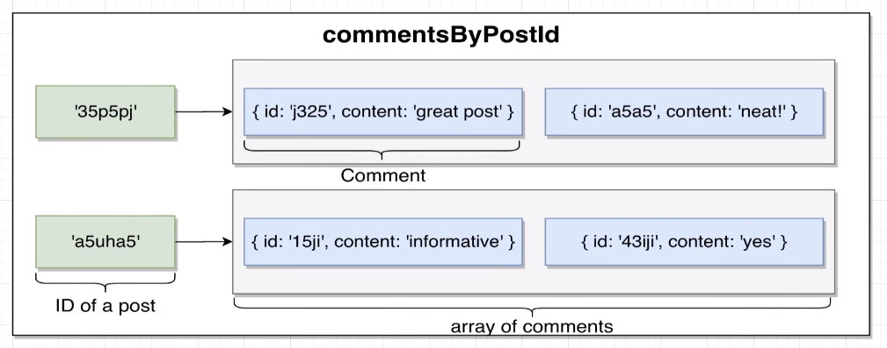

# 评论服务

## API:

| 路径                  | 方法   | 请求体              | 目标            |
|---------------------|------|------------------|---------------|
| /posts/:id/comments | POST | {content:String} | 根据文章ID新建评论    |
| /posts/:id/comments | GET  | -                | 根据给定的文章ID检索评论 |

- commentsByPostId的结构
- 